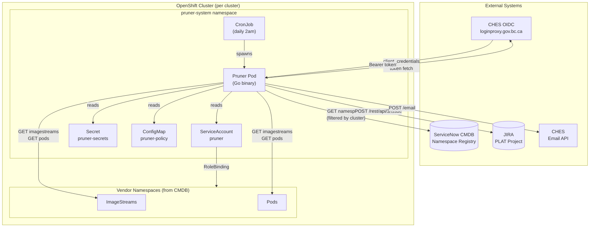
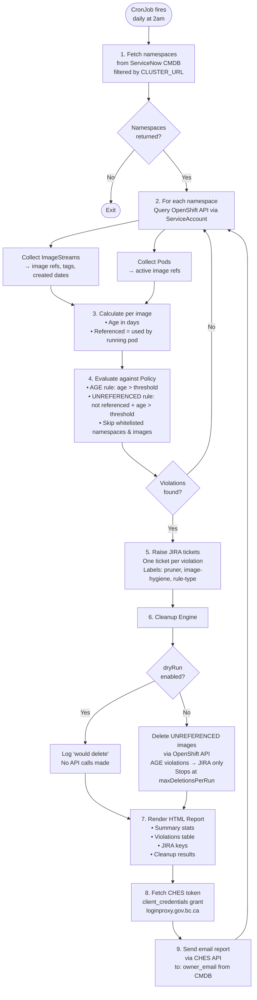
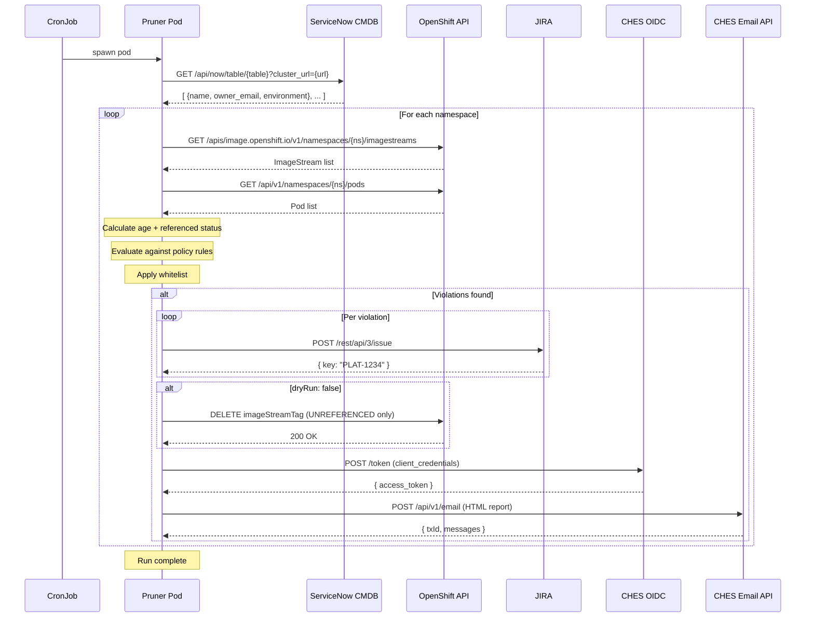

# Pruner — AG Image Hygiene Automation

Pruner is an ISB-owned automated service that enforces container image hygiene across vendor OpenShift namespaces. It detects stale and unreferenced images, raises JIRA tickets, notifies namespace owners, and safely removes eligible images.

---

## Table of Contents

- [Background](#background)
- [Architecture](#architecture)
- [Workflow](#workflow)
- [Components](#components)
- [Policy Configuration](#policy-configuration)
- [Environment Variables](#environment-variables)
- [Pre-Deployment Setup](#pre-deployment-setup)
  - [JIRA Setup](#jira-setup)
  - [ServiceNow CMDB Setup](#servicenow-cmdb-setup)
  - [CHES Setup](#ches-setup)
- [Deployment](#deployment)
- [Local Development](#local-development)

---

## Background

OCIO does not provide enterprise-level enforcement for container image hygiene across vendor-managed OpenShift namespaces. Pruner fills this gap by:

- Pulling the authoritative namespace list from **ServiceNow CMDB**
- Scanning **OpenShift ImageStreams** for stale and unreferenced images
- Evaluating findings against a **YAML policy** stored in Git
- Raising **JIRA tickets** for violations
- Sending **HTML email reports** to namespace owners via CHES
- Safely **deleting unreferenced images** (dry-run by default)

One instance of Pruner is deployed per OpenShift cluster. All instances share the same container image — behaviour is controlled by environment variables and policy config.

---

## Architecture



---

## Workflow



---

## Sequence Diagram



---

## Components

### Policy Definition Layer
Centralised YAML config stored in a Kubernetes ConfigMap (Git-versioned).
Defines age thresholds, cleanup rules, and namespace/image whitelists.
**File:** [`config/policy.yaml`](config/policy.yaml)

### Image Hygiene Scanner
Queries OpenShift `ImageStreams` and `Pods` per namespace via the Kubernetes API.
Calculates image age and determines if each image is actively referenced by a running pod.
**File:** [`internal/scanner/scanner.go`](internal/scanner/scanner.go)

### ServiceNow CMDB Client
Fetches the authoritative list of AG-owned namespaces from ServiceNow, filtered by the current cluster URL. Provides namespace name, owner email, and environment.
**File:** [`internal/cmdb/servicenow.go`](internal/cmdb/servicenow.go)

### Compliance Evaluator
Evaluates scan results against policy rules. Produces typed violations with severity levels (`HIGH`, `MEDIUM`, `LOW`). Respects whitelist configuration.
**File:** [`internal/compliance/evaluator.go`](internal/compliance/evaluator.go)

### Cleanup Engine
Safely deletes unreferenced images via the OpenShift `ImageStreamTag` API.
- Dry-run is the default — no deletions without explicit opt-in
- Only `UNREFERENCED` images are auto-deleted; `AGE` violations go to JIRA for human review
- Circuit breaker halts after `maxDeletionsPerRun` deletions

**File:** [`internal/cleanup/engine.go`](internal/cleanup/engine.go)

### JIRA Integration
Creates one JIRA ticket per violation in the configured project. Tickets include namespace, image ref, rule type, severity, age, and remediation instructions.
**File:** [`internal/jira/client.go`](internal/jira/client.go)

### Report Generator
Renders a per-namespace HTML email report showing violation summary, violations table, JIRA tickets raised, and cleanup results.
**File:** [`internal/report/report.go`](internal/report/report.go)

### CHES Email Notifier
Sends the HTML report to the namespace owner email (sourced from ServiceNow CMDB) via the BC Government Common Hosted Email Service (CHES). Fetches a fresh Bearer token via client credentials on every run.
**File:** [`internal/notify/email.go`](internal/notify/email.go)

---

## Policy Configuration

```yaml
# config/policy.yaml

maxImageAgeDays: 60

rules:
  - type: AGE
    threshold: 60        # flag images older than 60 days

  - type: UNREFERENCED
    threshold: 30        # flag unreferenced images older than 30 days

whitelist:
  namespaces:
    - legacy-system      # never scan this namespace
  images:
    - registry.example.com/critical/base:latest  # never flag this image

jira:
  project: PLAT
  issuetype: Bug
  slaDays: 14            # SLA breach after 14 days unresolved

cleanup:
  dryRun: true           # set to false to enable actual deletion
  maxDeletionsPerRun: 50 # circuit breaker
```

### Severity Matrix

| Rule | Condition | Severity |
|------|-----------|----------|
| AGE | age ≥ 3× threshold | HIGH |
| AGE | age ≥ 2× threshold | MEDIUM |
| AGE | age > threshold | LOW |
| UNREFERENCED | not referenced + age > threshold | HIGH |

---

## Environment Variables

| Variable | Required | Description |
|----------|----------|-------------|
| `POLICY_PATH` | No | Path to policy.yaml (default: `/config/policy.yaml`) |
| `CLUSTER_URL` | Yes | This cluster's API URL — used to filter CMDB namespaces |
| `SERVICENOW_URL` | Yes | ServiceNow instance base URL |
| `SERVICENOW_USER` | Yes | ServiceNow API username |
| `SERVICENOW_PASS` | Yes | ServiceNow API password |
| `SERVICENOW_TABLE` | Yes | CMDB table name for namespaces |
| `JIRA_URL` | Yes | Atlassian JIRA base URL |
| `JIRA_EMAIL` | Yes | JIRA bot account email |
| `JIRA_TOKEN` | Yes | JIRA API token |
| `JIRA_PROJECT` | Yes | JIRA project key (e.g. `PLAT`) |
| `CHES_CLIENT_ID` | Yes | CHES OIDC client ID |
| `CHES_CLIENT_SECRET` | Yes | CHES OIDC client secret |
| `CHES_FROM` | Yes | Sender email address (authorised in CHES) |

All secrets are stored in an OpenShift Secret (`pruner-secrets`) — never committed to Git.

---

## Pre-Deployment Setup

Before deploying Pruner, the following accounts and tokens must be created. Each section lists exactly what to ask and who to ask.

---

### JIRA Setup

**Who to contact:** IT / JIRA Administrator

#### Step 1 — Create a bot account

Ask IT to create a dedicated service account in Atlassian:

> "Please create a JIRA user account for `pruner-bot@yourdomain.com` to be used by an automation service."

- Use a shared mailbox or distribution list, not a personal email
- The account must be licensed in your Atlassian org

#### Step 2 — Grant project access

Ask IT to add the bot account to your JIRA project with create permissions:

> "Please add `pruner-bot@yourdomain.com` to project `[PROJECT KEY]` with the **Developer** role, or a custom role that includes **Create Issues** permission. Also grant the account the **Browse Users and Groups** global permission so it can look up users for issue assignment."

Minimum permissions required:

| Permission | Scope | Why |
|------------|-------|-----|
| Create Issues | Project-level | Raise violation tickets |
| Browse Users and Groups | Global | Look up namespace owner account ID for assignment |

#### Step 3 — Generate an API token

The bot account owner logs into Atlassian and generates a token:

1. Go to `https://id.atlassian.com/manage-profile/security/api-tokens`
2. Click **Create API token**
3. Name it `pruner-bot-token`
4. Copy the token immediately — it is only shown once

#### Step 4 — Collect the following values

| Value | Where to find it | Example |
|-------|-----------------|---------|
| `JIRA_URL` | Your Atlassian org URL | `https://yourorg.atlassian.net` |
| `JIRA_EMAIL` | Bot account email | `pruner-bot@yourdomain.com` |
| `JIRA_TOKEN` | API token from Step 3 | `ATATT3xFfGF0...` |
| `JIRA_PROJECT` | Project key visible in JIRA URL | `PLAT` |

---

### ServiceNow CMDB Setup

**Who to contact:** ServiceNow Administrator

Pruner queries ServiceNow to get the list of AG-owned namespaces per cluster.

#### Step 1 — Identify the CMDB table

Ask your ServiceNow admin:

> "What is the table name in CMDB that stores Kubernetes namespace records? We need to query it for namespace name, cluster URL, and owner email."

The table is typically named something like:
- `cmdb_ci_kubernetes_namespace`
- `cmdb_ci_k8s_namespace`

#### Step 2 — Confirm required fields exist

The pruner expects these fields on each CMDB record:

| Field | Description |
|-------|-------------|
| `name` | Namespace name (e.g. `vendor-ns-42`) |
| `cluster_url` | OpenShift API URL (e.g. `https://api.cluster-a.example.com:6443`) |
| `owner_email` | Namespace owner's email address |
| `environment` | Environment tag (e.g. `prod`, `dev`) |

If any fields are named differently in your instance, update [internal/cmdb/servicenow.go](internal/cmdb/servicenow.go) to match.

#### Step 3 — Create a read-only service account

Ask your ServiceNow admin:

> "Please create a service account for an automation called `pruner-svc` with **read-only** access to the `[table name]` table via the REST API."

#### Step 4 — Collect the following values

| Value | Description |
|-------|-------------|
| `SERVICENOW_URL` | ServiceNow instance URL e.g. `https://yourorg.service-now.com` |
| `SERVICENOW_USER` | Service account username |
| `SERVICENOW_PASS` | Service account password |
| `SERVICENOW_TABLE` | CMDB table name |
| `CLUSTER_URL` | This cluster's API URL — used to filter namespaces |

---

### CHES Setup

**Who to contact:** CHES Onboarding Team (`bcgov/common-hosted-email-service`)

CHES (Common Hosted Email Service) is the BC Government email delivery platform.

#### Step 1 — Request onboarding

Submit an onboarding request to the CHES team to get a client registered:

> "We need a CHES client for an automated service called Pruner that sends image hygiene compliance reports to namespace owners. Expected volume: ~[N] emails per day."

#### Step 2 — Collect the following values

After onboarding, CHES will provide:

| Value | Description |
|-------|-------------|
| `CHES_CLIENT_ID` | Your CHES client ID |
| `CHES_CLIENT_SECRET` | Your CHES client secret |
| `CHES_FROM` | Authorised sender address (provided by CHES team) |

---

## Deployment

### Prerequisites
- OpenShift namespace `pruner-system` exists
- Kubernetes ServiceAccount `pruner` created in `pruner-system`
- `pruner` ServiceAccount has `admin` RoleBinding in all target AG namespaces
- CHES client credentials obtained from the CHES service team
- JIRA API token created for the bot account

### Deploy

```bash
# 1. Create secrets (run once)
bash deploy/secrets.sh

# 2. Apply manifests
oc apply -f deploy/serviceaccount.yaml -n pruner-system
oc apply -f deploy/configmap.yaml      -n pruner-system
oc apply -f deploy/cronjob.yaml        -n pruner-system

# 3. Trigger a manual test run
oc create job pruner-test \
  --from=cronjob/pruner \
  -n pruner-system

# 4. Watch logs
oc logs -f job/pruner-test -n pruner-system
```

### Enable Live Cleanup (after dry-run validation)

Edit the ConfigMap and set `dryRun: false`:

```bash
oc edit configmap pruner-policy -n pruner-system
```

---

## Local Development

To run locally (outside a cluster), swap `rest.InClusterConfig()` for a kubeconfig:

```bash
export KUBECONFIG=~/.kube/config
export CLUSTER_URL=https://api.your-cluster.example.com:6443
export SERVICENOW_URL=...
# set all other env vars

go run ./cmd/pruner
```

You will need to update `cmd/pruner/main.go` to use `clientcmd.BuildConfigFromFlags("", os.Getenv("KUBECONFIG"))` instead of `rest.InClusterConfig()` for local runs.

---

## Project Structure

```
pruner/
├── cmd/
│   └── pruner/
│       └── main.go               # Entry point and orchestrator
├── internal/
│   ├── cmdb/
│   │   └── servicenow.go         # ServiceNow CMDB client
│   ├── scanner/
│   │   └── scanner.go            # OpenShift image + pod scanner
│   ├── compliance/
│   │   └── evaluator.go          # Policy evaluation engine
│   ├── cleanup/
│   │   └── engine.go             # Image deletion engine
│   ├── jira/
│   │   └── client.go             # JIRA REST API client
│   ├── report/
│   │   └── report.go             # HTML + text report renderer
│   └── notify/
│       └── email.go              # CHES email notification client
├── config/
│   └── policy.yaml               # Default policy configuration
├── deploy/
│   ├── serviceaccount.yaml       # ServiceAccount manifest
│   ├── cronjob.yaml              # CronJob manifest
│   ├── configmap.yaml            # Policy ConfigMap
│   └── secrets.sh                # Secret creation script
├── Dockerfile
├── go.mod
└── go.sum
```
